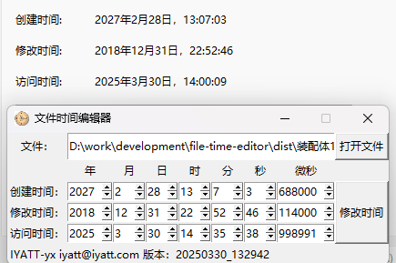

# file-time-editor 文件时间编辑器

2025.3.29
上午的时候，因为一些需要要改文件时间，又没找到好用的，就手动写了一段死代码改。想着以后可能也有使用的需求，下午用三个小时时间写了更通用的，方便使用的时候按需选择文件和设定时间。  

## 测试环境

* Windows 11 24H2
* NTFS 文件系统
* Python 3.13.1（支持 Windows 7 以上，不包含 Windows 7）

## 已知问题

2025.3.30  
1.创建时间是通过 pywin32 库间接调用 Windows API 进行修改的，不知道是不是 pywin32 实现的问题。设置时间精确到微秒，但最终会丢失精度设置到毫秒级别，也就是这里实际设置微秒只能精确到 1000 的整数倍；  
2.访问时间修改则让我有点摸不着头脑，时而可以修改到指定时间，时而会被刷新到执行修改的时间，；  